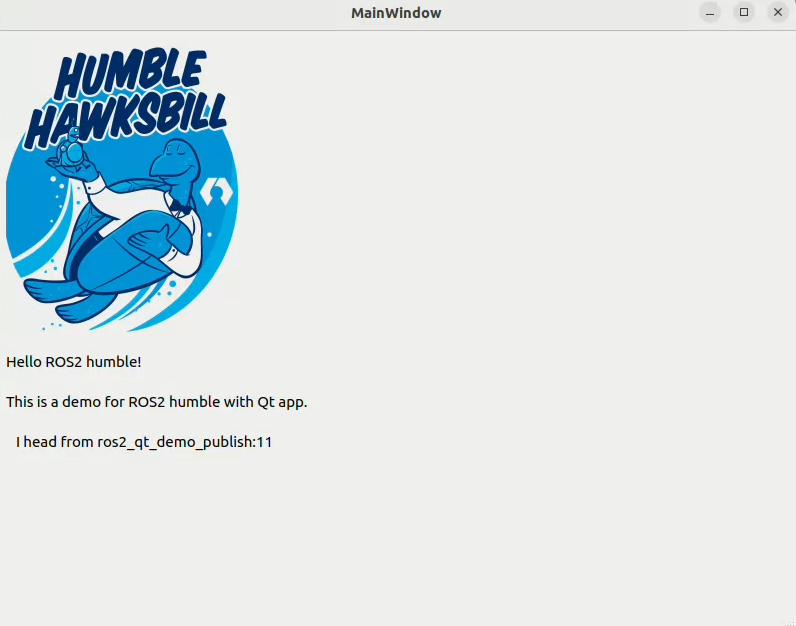

# ros2_qt_demo
A demo pkg for ros2 and qt, and test in ros2 humble.

Configurations:

- Ubunt 22.04
- Ros2 Humble
- Qt Creator 13.0.0
- ROS ProjectManager 13.0.0


# how to build
You can click the `build` button in  Qt Creator or just use the CLT in the workspace of qt as:

```bash
colcon build
```

# how to use
Make sure you have sourced your workspace and then run in terminal:

```bash
cd <your_workspace>
source install/setup.bash
ros2 run ros2_qt_demo ros2_qt_demo
```


# result

<div align=center>

